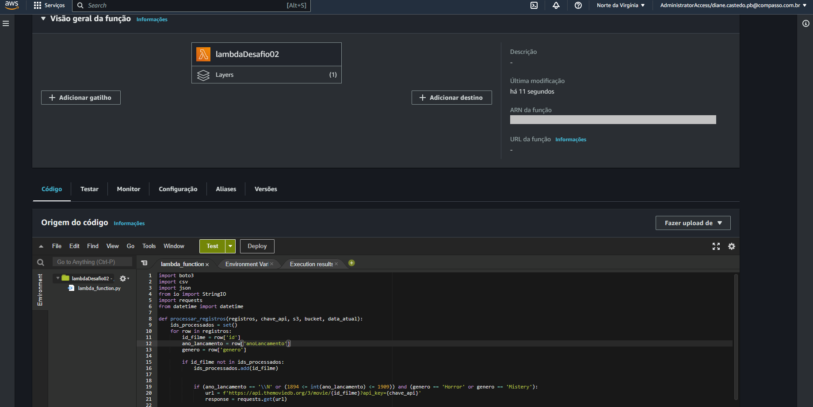
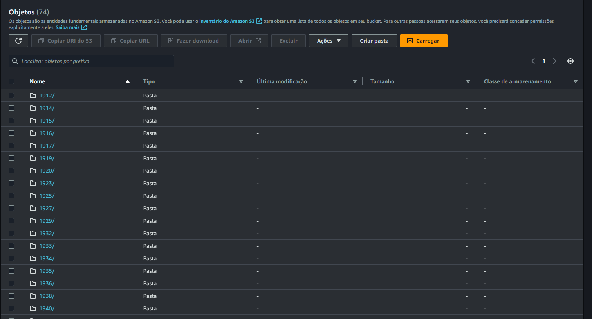

# Desafio

## [Parte 01](parte_01/app)

Ingestão Batch: a ingestão dos arquivos CSV em Bucket Amazon S3 RAW Zone. Nesta etapa do desafio deve ser construído um código Python que será executado dentro de um container Docker para carregar os dados locais dos arquivos para a nuvem. Nesse caso utilizaremos, principalmente, as lib boto3 como parte do processo de ingestão via batch para geração de arquivo (CSV).

1) Implementar código Python:
- ler os 2 arquivos (filmes e series) no formato CSV inteiros, ou seja, sem filtrar os dados
- utilizar a lib boto3 para carregar os dados para a AWS
- acessar a AWS e grava no S3, no bucket definido com RAW Zone
- no momento da gravação dos dados deve-se considerar o padrão: <nome do bucket>\<camada de armazenamento>\<origem do dado>\<formato do dado>\<especificação do dado>\<data de processamento separada por ano\mes\dia>\<arquivo>
Por exemplo:
    S3:\\data-lake-do-fulano\Raw\Local\CSV\Movies\2022\05\02\movies.csv
    S3:\\data-lake-do-fulano\Raw\Local\CSV\Series\2022\05\02\series.csv

2) Criar container Docker com um volume para armazenar os arquivos CSV e executar processo Python implementado

3) Executar localmente o container docker para realizar a carga dos dados ao S3

## [Parte 02](parte_02/lambdaDesafio02.py)

Compreende a captura dos tweets em tempo real com Python e/ou a captura de dados existentes na API TMBD. Os dados coletados devem ser persistidos em Amazon S3 RAW Zone, mantendo o formato da origem (JSON), agrupando-os em arquivos com, no máximo, 100 tweets cada quando possível

Etapa 2 - Ingestão streaming/micro batch

Neste etapa do desafio, nos iremos capturar tweets em tempo real com Python por meio da lib tweepy e/ou dados existentes na API do TMDB via AWS Lambda. Os dados coletados devem ser persistidos em Amazon S3, camada de RAW Zone, mantendo o formato da origem (JSON) e, se possível, agrupando-os em arquivos com, no máximo, 100 tweets cada
O objetivo desta etapa é enriquecer os dados dos Filmes e Series carregados na Etapa 1 com dados externos do Twitter e/ou do TMDB e/ou de outra API a sua escolha.

Importante:

Os arquivos CSVs carregados na Etapa 1 não devem ser modificados.
Os novos dados devem ser complementares aos dados do CSV. Tem que existir informações novas sobre os dados do CSV.
Não é necessário realizar tratamento dos dados externos, o máximo que pode ser feito é o agrupamento de dados.
Cuidado para os arquivos JSON gerados não serem maior do que 10 MB.
Não agrupe JSON com estruturas diferentes.
Se você escolher por fazer o desafio por todos atores ou séries ou filmes de uma ou mais categorias, utilize o CSV carregado na Etapa 1 como fonte de entrada para localização dos IDs do IMDB para depois realizar a pesquisa no TMDB.
Se você escolher fazer sobre um filme ou uma trilogia específica, considere utilizar pelo menos 4 métodos de API diferentes para possibilitar uma análise de dados qualificada.
Considere desenvolver seu código localmente primeiro e com poucos dados para depois leva-lo para a AWS Lambda e aumentar a pesquisa de dados. APIs normalmente limitam requisições. Evite realizar muitas requisições em fase de desenvolvimento ou teste para evitarmos qualquer bloqueio na conta de vocês
Esta atividade corresponde a parte do desafio final. Não esperamos que você registre resposta neste espaço. Contudo, deves adicionar o código-fonte produzido ao seu repositório no Github. Lembre-se de remover suas credenciais de acesso antes de efetuar commit.

Perguntas dessa tarefa

Em sua conta AWS, no serviço AWS Lambda, realize as seguintes atividades:
1.  Criar nova camada (layer) no AWS Lambda para as libs necessárias à ingestão de dados (por exemplo,  tweepy, se você utilizar o Tweeter)
2. Implementar o código Python em AWS Lambda para consumo de dados do Twitter/TMDB:
   - Se está utilizando Twitter, buscar os tweets de interesse para a análise (neste ponto você já deve ter definido qual análise planeja realizar com os dados) e agrupar os tweets em arquivo JSON com, no máximo, 100 registros cada
   - Se está utilizando TMDB,  buscar pela API os dados que complementem a análise
   - Utilizar a lib boto3 para gravar os dados no AWS S3
    -----| no momento da gravação dos dados deve-se considerar o padrão de path: <nome do bucket>\<camada de armazenamento>\<origem do dado>\<formato do dado>\<especificação do dado>\<data de processamento separada por ano\mes\dia>\<arquivo>

        São exemplos de caminhos de arquivos válidos:

        - S3:\\data-lake-do-fulano\Raw\Twitter\JSON\2022\05\02\prt-uty-nfd.json

        - S3:\\data-lake-do-fulano\Raw\Twitter\JSON\2022\05\02\idf-uet-wqt.json

Código Lambda

Armazenamento S3

## [Parte 03](parte_03)

Processamento -  Camada Trusted

A camada Trusted de um data lake corresponde àquela em que os dados encontram-se limpos e são confiáveis. É resultado da integração das diversas fontes de origem, que encontram-se na camada anterior, que chamamos de Raw.

Aqui faremos uso do Apache Spark no processo, integrando dados existentes na camada Raw Zone. O objetivo é gerar uma visão padronizada dos dados, persistida no S3,  compreendendo a Trusted Zone do data lake.  Nossos jobs Spark serão criados por meio do AWS Glue.

Todos os dados serão persistidos na Trusted no formato PARQUET, particionados por data de criação do tweet  ou data de coleta do TMDB (dt=<ano\mês\dia> exemplo: dt=2018\03\31). A exceção fica para os dados oriundos do processamento batch (CSV), que não precisam ser particionados.

Iremos separar o processamento em dois jobs: o primeiro, para carga histórica, será responsável pelo processamento dos arquivos CSV  e o segundo, para carga de dados do Twitter/TMDB. Lembre-se que suas origens serão os dados existentes na RAW Zone.

Perguntas dessa tarefa
Realize as atividades conforme as instruções. Neste espaço, você pode adicionar prints dos jobs criados. Contudo, lembre-se de adicionar todo código elaborado no seu repositório do Github.

Modelagem de dados - Camada Refined

A camada Refined corresponde à camada de um data lake em que os dados estão prontos para análise e extração de insights. Sua origem corresponde aos dados da camada anterior, a Trusted.

Devemos pensar em estruturar os dados seguindo os princípios de modelagem multidimensional, a fim de permitir consultas sobre diferentes perspectivas.

Nesta etapa do desafio, devem ser criadas no AWS Glue Data Catalog  as tabelas e, se necessário, views,  de acordo com modelagem de dados solicitada, a fim de disponibilizar os dados para a ferramenta de visualização (QuickSight, a partir da próxima Sprint). Lembre-se que a origem será os dados oriundos da Trusted Zone.

Perguntas dessa tarefa
Apresentar a modelagem de dados da camada Refined. Você pode exportar seu modelo de dados na forma de imagem e registrar aqui. Lembre-se de deixá-lo disponível também no seu repositório do Github.

Processamento de dados - Camada Refined

Na atividade anterior, você definiu seu modelo de dados da camada Trusted. Agora é tempo de processar os dados da camada Trusted, armazena-os na Refined, de acordo com seu modelo.

Aplicaremos novamente o Apache Spark no processo, utilizando jobs cuja origem sejam dados da camada Trusted Zone e e o destino, a camada Refined Zone.  Aqui, novamente, todos os dados serão persistidos no formato PARQUET, particionados, se necessário,  de acordo com as necessidades definidas para a camada de visualização.

Perguntas dessa tarefa
Desenvolva os jobs de processamento de acordo com as instruções. Aqui você pode apresentar prints do seu código. Lembre-se também de adicionar todo código produzido ao seu repositório no Github.

## [Parte 04](parte_04)

Chegamos na última etapa do desafio. Até este ponto, suas atividades no data lake foram voltadas à ingestão e preparação dos dados. Agora é momento de extrair insights, apresentando-os através de uma ferramenta de visualização de dados (QuickSight).

Para tal, você deverá criar um dashboard no AWS QuickSight, utilizando como fonte de dados as tabelas que estão na camada Refined do data lake. Considere utilizar o Athena para como tipo de datasource.

Lembre-se que um dashboard é um agregado de diferentes visualizações que retratam uma visão agregada e de alto nível sobre os dados. Explore os diferentes recursos que o QuickSight oferece para, a partir dela, realizar uma boa narrativa com os dados disponíveis.

Perguntas dessa tarefa
Desenvolva um dashboard utilizando AWS QuickSight conforme instruções da tarefa.
