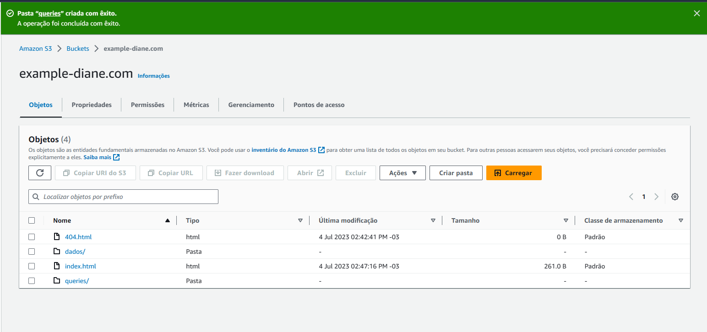
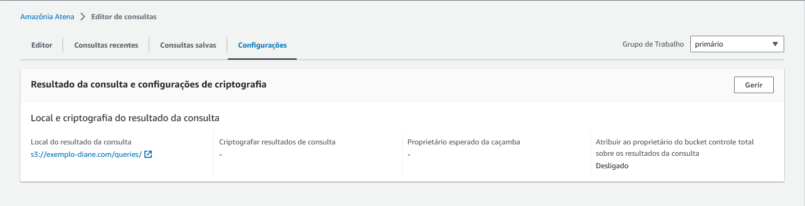
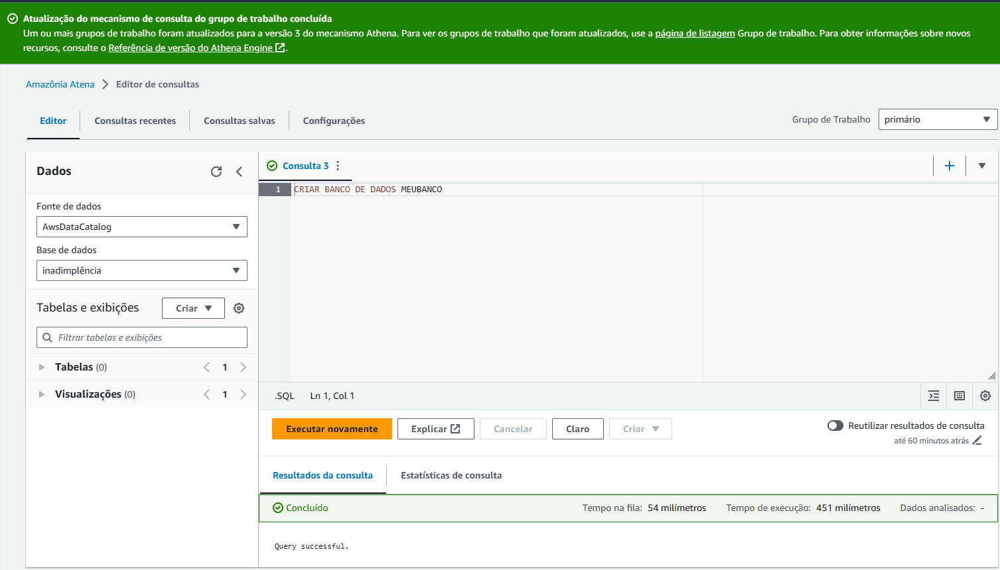
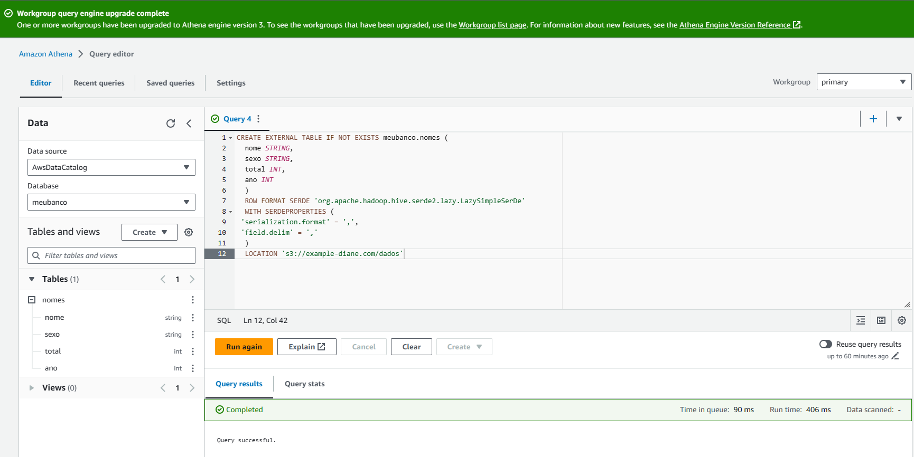
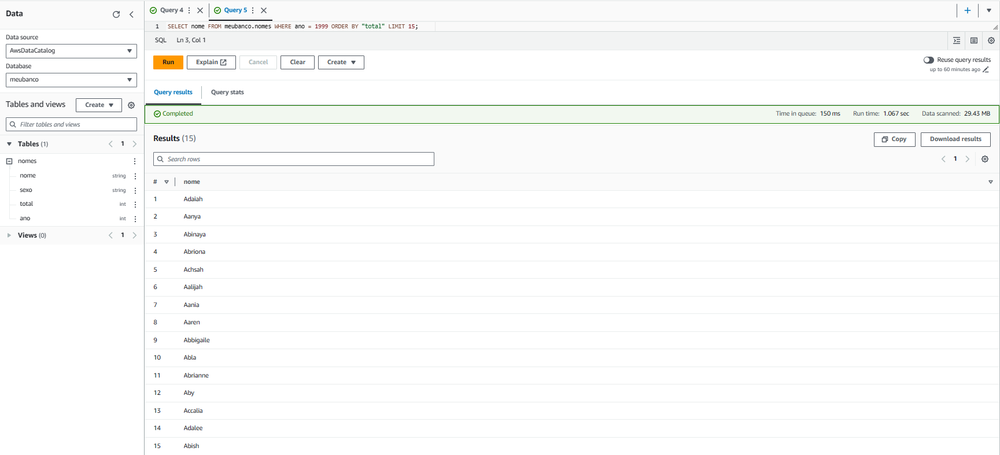
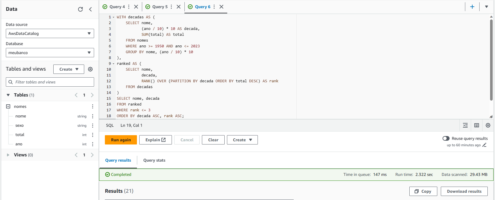
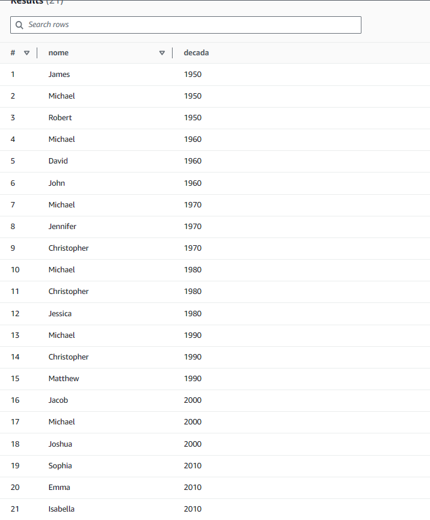

### *Etapa 1: Configurar Athena*

1.	No Console, busque pelo serviço S3.
2.	Verifique se o arquivo nomes.csv está no Bucket name (Nome do bucket) criado no laboratório de S3. Se não tiver, execute as seguintes etapas:
  	2.1. Selecione Create bucket (Criar bucket)
    2.2. Insira o Bucket name (Nome do bucket).
    2.3. Selecione a região onde você deseja criar o bucket (US East (N. Virginia) us-east-1)
    2.4. Para aceitar as configurações padrão e criar o bucket, escolha Create (Criar).
    2.5. Para fazer upload do arquivo, siga um destes procedimentos:
    2.6. Arraste e solte o arquivo na listagem de buckets do console.
    2.7. Escolha Upload (Fazer upload) e siga as instruções para escolher e fazer upload do arquivo.
3. Realize download do arquivo nomes.csv (caso não tenha feito ainda).
4.	Analise o arquivo descobrindo o nome e o tipo de dado de cada coluna.
5.	De volta  ao Console AWS, crie uma pasta dentro do bucket chamada queries. O AWS Athena usará esta pasta para armazenar as consultas executadas.
6.	Acesse o AWS Athena e clique em Explore the Query Editor (Explorar o editor de consultas).
7.	No Athena, escolha View Settings (Visualizar configurações) para configurar um local para os resultados de consultas no Amazon S3.
8.	Na guia Settings (Configurações), escolha Manage (Gerenciar).
9.	Em Manage settings (Gerenciar configurações), faça um dos seguintes procedimentos:
    9.1.	Na caixa de texto Query result location (Localização dos resultados da consulta), insira o caminho para o bucket criado no Amazon S3 para resultados de consultas. Adicione o prefixo s3:// ao caminho. E aponte para a pasta queries criada.
    9.2.	Escolha Browse S3 (Navegar no S3), escolha o bucket do Amazon S3 que você criou na região atual e escolha Choose (Escolher).
10.	Escolha Save (Salvar).
11.	Selecione Editor para alternar para o editor de consultas.

___

### *Etapa 2: Criar um banco de dados*

1. À direita do painel de navegação, você pode usar o editor de consultas do Athena para inserir e executar as consultas e instruções.
2. Para criar um banco de dados denominado meubanco, insira a instrução CREATE DATABASE
3. Selecione Run (Executar) ou pressione Ctrl+ENTER.
4. Na lista Database (Banco de dados) à esquerda, escolha meubanco para torná-lo seu banco de dados atual.

___

### *Etapa 3: Criar uma tabela*

Agora que você tem um banco de dados, pode criar uma tabela do Athena para ele. A tabela criada será baseada nos dados de log de exemplo do Amazon CloudFront, no local s3://athena-examples-myregion/cloudfront/plaintext/, em que myregion é a sua Região da AWS atual. Abaixo um exemplo:

        CREATE EXTERNAL TABLE IF NOT EXISTS data.cloudfront_logs (
          `Date` DATE,
          Time STRING,
          Location STRING,
          Bytes INT,
          RequestIP STRING,
          Method STRING,
          Host STRING,
          Uri STRING,
          Status INT,
          Referrer STRING,
          ClientInfo STRING
          ) 
          ROW FORMAT DELIMITED
          FIELDS TERMINATED BY '\t'
          LINES TERMINATED BY '\n'
          LOCATION 's3://athena-examples-my-region/cloudfront/plaintext/';
1. Elabore a query para criar a tabela no banco de dados que você criou. Abaixo apresentamos um template para a estrutura de dados.

        CREATE EXTERNAL TABLE IF NOT EXISTS <nome do banco de dados>.<nome da tabela> (
          <nome dos campos com o tipo de dados>
        )
        ROW FORMAT SERDE 'org.apache.hadoop.hive.serde2.lazy.LazySimpleSerDe'
        WITH SERDEPROPERTIES (
        'serialization.format' = ',',
        'field.delim' = ','
        )
        LOCATION <caminho do S3> 
2. Escolha Run.

3. Se a importação for bem-sucedida, você verá uma mensagem verde Completed (Concluído)
Algumas itens a observar para a atividade:
    
    3.1. Definimos todos os campos no conjunto de dados e demos a eles um tipo apropriado.

    3.2. Informamos ao Athena para usar o analisador LazySimpleSerDe CSV. Usamos esse analisador porque ele permite valores nulos para números. Ele não suporta valores entre aspas.

    3.3. Informamos ao analisador que os campos são delimitados por vírgulas e que a primeira linha contém nomes de campos que podem ser ignorados.

    3.4. Especificamos o local do arquivo CSV. Precisamos apenas fornecer a pasta, não o arquivo em si.

4. Teste os dados com a seguinte consulta, substituindo o nome dos campos, banco de dados e tabela pelos nomes que você criou anteriormente:

      select nome from nomedobanco.nomedatabela where ano = 1999 order by total limit 15;

5. Crie uma consulta que lista os 3 nomes mais usados em cada década desde o 1950 até hoje.

