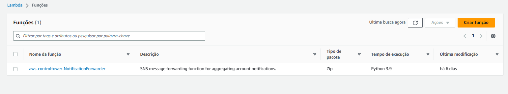

Após concluir todas as etapas dos laboratórios e de colher as evidências/códigos para repassar ao monitor (a), você deve realizar a limpeza do que foi criado, para não incorrer em custos desnecessários.

