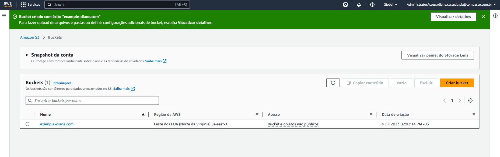
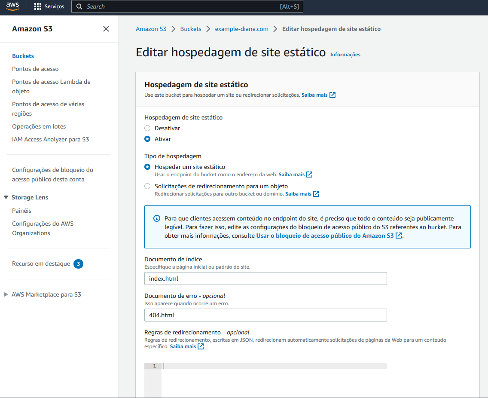
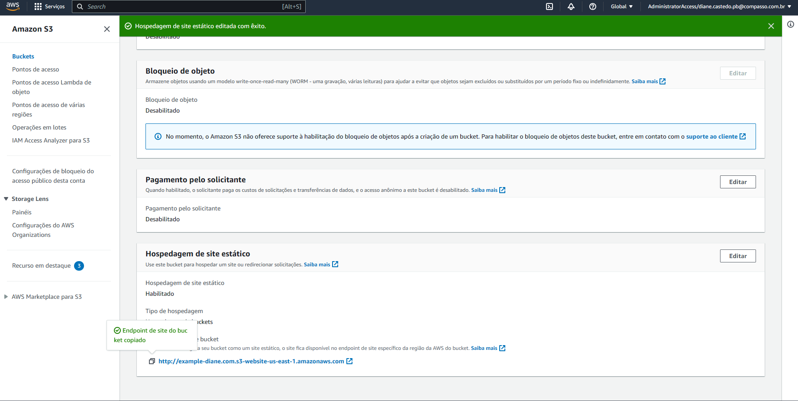
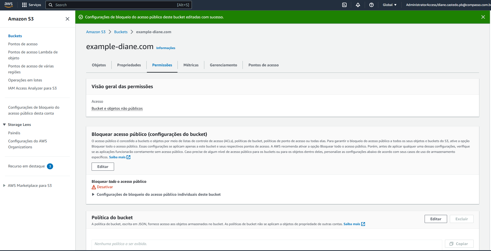
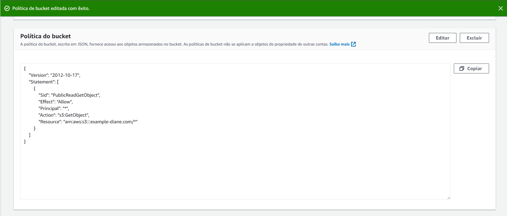
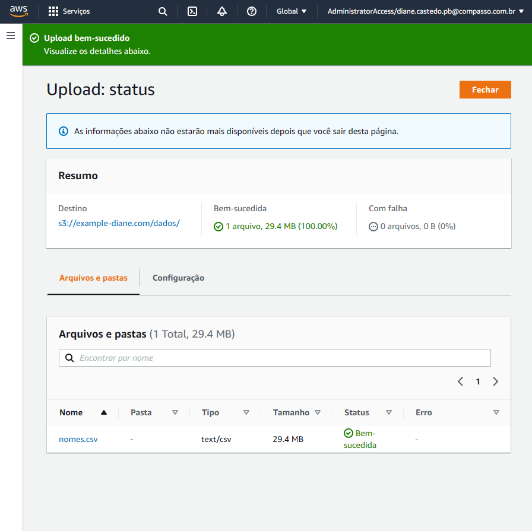
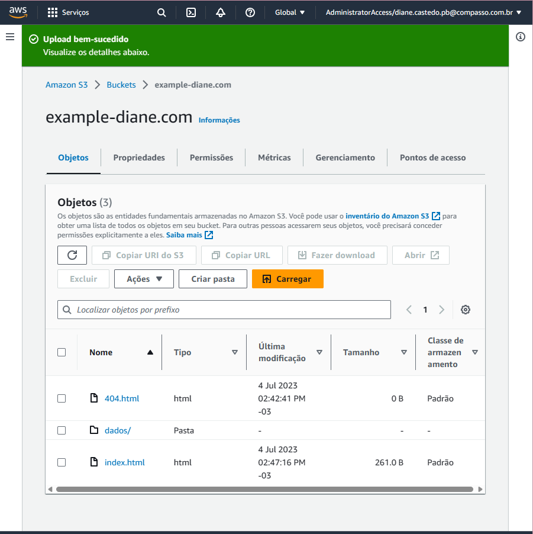
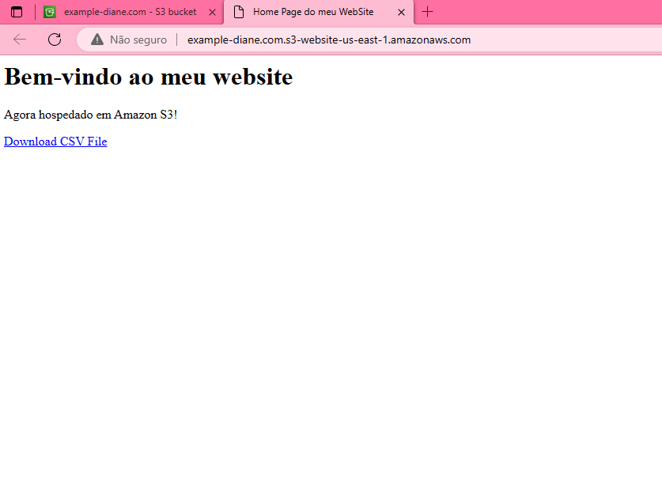

### *Etapa 1: Criar um bucket*

As instruções a seguir fornecem uma visão geral de como criar seus buckets para hospedagem de conteúdo estático:

1. No Console, busque pelo serviço S3.
2. Selecione Create bucket (Criar bucket).
3. Insira o Bucket name (Nome do bucket) (por exemplo, example.com).
4. Selecione a região onde você deseja criar o bucket. Escolha US East (N. Virginia) us-east-1.
5. Para aceitar as configurações padrão e criar o bucket, escolha Create (Criar).

___

### *Etapa 2: Habilitar hospedagem de site estático*

Depois de criar um bucket, você pode habilitar a hospedagem de site estático nele. Os passos necessários são:

1. No Console, busque pelo serviço S3.
2. Na lista Buckets, escolha o nome do bucket para o qual você deseja habilitar a hospedagem de site estático.
3. Escolha Properties (Propriedades).
4. Em Static website hosting (Hospedagem estática de sites), escolha Edit (Editar).
5. Escolha Use this bucket to host a website (Usar este bucket para hospedar um site).
6. Em Static website hosting (Hospedagem estática de sites), escolha Enable (Ativar).
7. Em Index Document (Documento de índice), insira o nome do arquivo do documento de índice, que geralmente é index.html.
8. Para fornecer seu próprio documento de erros personalizado para erros da classe 4XX, em Error document (Documento de erros), insira o nome de arquivo do documento de erros personalizado. 
9. (Opcional) Se você quiser especificar regras avançadas de redirecionamento em Redirection rules (Regras de redirecionamento), use JSON para descrevê-las. 
10. Selecione Save changes.O Amazon S3 permite a hospedagem estática de sites para seu bucket. Na parte inferior da página, em Static website hosting (Hospedagem estática de sites), você verá o endpoint do site do seu bucket.
11. Em Static website hosting (Hospedagem de sites estáticos), copie o endpoint informado. O Endpoint é o endereço do site do Amazon S3 para o bucket.  Informe o endereço na barra de navegação de seu navegador para testar o resultado.

___

### *Etapa 3: editar as configurações do Bloqueio de acesso público*

Por padrão, o Amazon S3 bloqueia o acesso público à sua conta e aos seus buckets. Se quiser usar um bucket para hospedar um site estático, use estas etapas para editar as configurações de bloqueio de acesso público.

1. No Console, busque pelo serviço S3.
2. Escolha o nome do bucket configurado como um site estático.
3. Escolha Permissions (Permissões).
4. Em Block public access (bucket settings) Bloqueio de acesso público (configurações de bucket), escolha Edit (Editar).
5. Desmarque Block all public access (Bloquear todo acesso público) e escolha Save changes (Salvar alterações).
6. O Amazon S3 desativa as configurações do bloqueio de acesso público para seu bucket. Para criar um site público e estático, você também pode ter que editar as configurações de Bloqueio de acesso público para sua conta antes de adicionar uma política de bucket. Se as configurações da conta para bloquear acesso público estiverem ativadas no momento, você verá uma observação em Block public access (bucket settings) (Bloqueio de acesso público (configurações de bucket)).

___

### *Etapa 4: Adicionar política de bucket que torna o conteúdo do bucket publicamente disponível*

Depois de editar as configurações do bloqueio de acesso público do S3, é possível adicionar uma política de bucket para conceder acesso público de somente leitura ao bucket. Ao conceder um acesso público de leitura, qualquer pessoa na Internet poderá acessar seu bucket.

1. Em Buckets, escolha o nome do seu bucket.
2. Escolha Permissions (Permissões).
3. Em Bucket Policy (Política de bucket), escolha Edit (Editar).
4.Para conceder acesso público de leitura ao site, copie a política de bucket a seguir e cole-a no Bucket policy editor (Editor de política de bucket).
5. No JSON acima, substitua, na seção Resource, o valor de Bucket-Name para o nome do seu bucket.
6. Na política de bucket do exemplo anterior, Bucket-Name é um espaço reservado para o nome do bucket. Para usar essa política de bucket com seu próprio bucket, você deve atualizar esse nome para corresponder ao nome do seu bucket.
7. Selecione Save changes.
8.Uma mensagem é exibida indicando que a política de bucket foi adicionada com sucesso.

___

### *Etapa 5: Configurar um documento de índice*

Quando você habilita a hospedagem de sites estáticos para seu bucket, deve informar o nome do documento de índice (por exemplo, index.html). Naturalmente, o arquivo informado deverá estar presente no bucket para que a configuração tenha efeito. Vamos aos passo para configuração do documento de índice:

1. Criar um arquivo local (sua máquina) com o nome index.html . O conteúdo do arquivo deverá ser (atente-se para o atributo href do link, pois ele deverá apontar para o arquivo CSV).
2. Salvar as alterações.
3. No Console, busque pelo serviço S3.
4. Na lista Buckets, selecione o nome do bucket que você configurou hospedagem de conteúdo estático.
5. Para fazer upload do documento de índice para o bucket, siga um destes procedimentos:
6 .Arraste e solte o arquivo de índice na listagem de buckets do console.
7. Escolha Upload (Fazer upload) e siga as instruções para escolher e fazer upload do arquivo de índice.
8. Crie uma pasta chamada dados e, após, faça upload do conteúdo do site (arquivo CSV) para ela.

___

### *Etapa 6: configurar documento de erros*

Depois de habilitar a hospedagem de sites estáticos para seu bucket, faça upload para o bucket de um arquivo HTML para notificação de erros.  Veja quais são os passos:

1. Crie um documento de erro com o nome 404.html.
2. Salve o arquivo localmente.
3.O nome do documento de erros diferencia maiúsculas e minúsculas e deve corresponder exatamente ao nome que você insere ao habilitar a hospedagem estática do site. Por exemplo, se você inserir 404.html como o nome do Error document (Documento de erro) na caixa de diálogo Static website hosting (Hospedagem de site estático), o nome de arquivo do documento de erro também deve ser 404.html.
4. No Console, busque pelo serviço S3.
5. Na lista Buckets, selecione o nome do bucket que você configurou hospedagem de conteúdo estático.
6. Para fazer upload do documento de erros para o bucket, siga um destes procedimentos:
7. Arraste e solte o arquivo de índice na listagem de buckets do console.
8. Escolha Upload (Fazer upload) e siga as instruções para escolher e fazer upload do arquivo de índice.

___

### *Etapa 7: testar o endpoint do site*

Depois de configurar a hospedagem de site estático para seu bucket, você pode testá-lo em seu navegador. Para tal, siga os passos a seguir:

1. No Console, busque pelo serviço S3.
2. Na lista Buckets, selecione o nome do bucket que você configurou hospedagem de conteúdo estático.
3. Escolha Properties (Propriedades).
4. Na parte inferior da página, em Static website hosting (Hospedagem estática de sites), escolha seu Bucket website endpoint (Endpoint de site do Bucket). Seu documento de índice é aberto em uma janela separada do navegador.
5. Agora você tem um site hospedado no Amazon S3. Esse site está disponível publicamente no endpoint de site do Amazon S3. Você pode também ter um domínio, como example.com, para exibir o conteúdo do site que criou. Neste caso, é preciso executar etapas adicionais.

