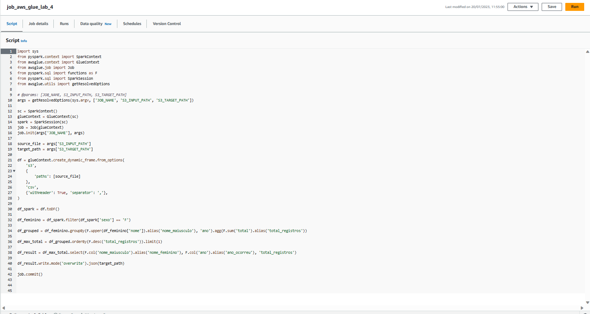

## EXERCÍCIO LAB AWS GLUE 

1. Criação do bucket para armazenar o csv e outro para receber dados retornados.

2. Configurando as permissões para acessar o Lake Formation
 

3. Criando o Database
 

4. Criando o Crawler 
 

5. Job para gerar o schema

6. Job para contagem total de linhas

7. Job para contagem do nome feminino com mais registros e ano

8. Job para contagem do nome masculino com mais registros e ano

9. Job para contagem do total de registros para cada ano

___

### ARQUIVOS GERADOS

* Schema

* Contagem de Linhas

* Contagem de nomes femininos
 

* Contagem de nomes masculinos 

* Contagem do nome feminino com mais registros e ano

* Contagem do nome masculino com mais registros e ano

* Contagem total de nomes por ano

