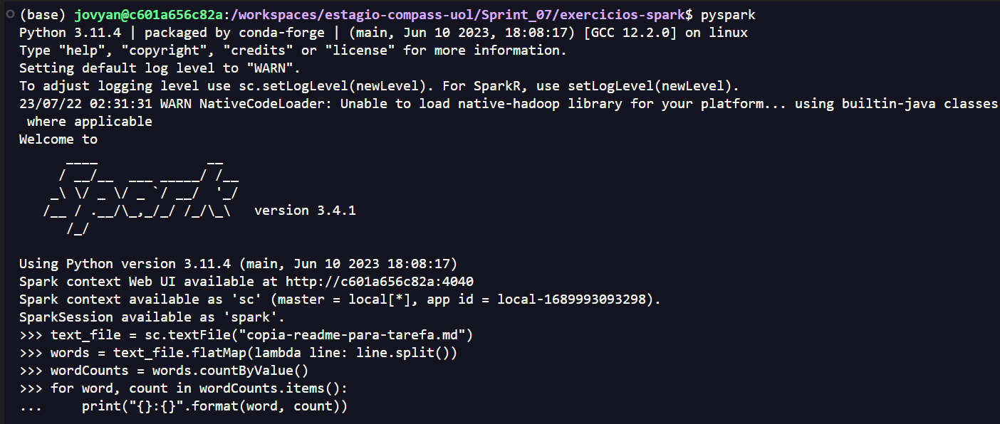

Neste exercícios iremos construir um job Spark por meio de um container Docker. Lembre-se de adicionar seu código-fonte ao Github.

Perguntas dessa tarefa
Siga os passos a seguir para executar o Spark utilizando uma imagem Docker:
a) Instalar o Docker (https://docs.docker.com/desktop/install/windows-install)
b) Instalar o Visual Studio Code (https://code.visualstudio.com/Download)
c) Instalar as extensões  abaixo no Visual Studio Code:
- Python (ms-python.python), disponível em https://marketplace.visualstudio.com/items?itemName=ms-python.python
- Dev - Containers, disponível em
https://marketplace.visualstudio.com/items?itemName=ms-vscode-remote.remote-containers
d) Criar no seu diretório de trabalho (uma pasta onde você terá o código-fonte) um arquivo chamado Dockerfile e inserir o seguinte conteúdo:

    FROM jupyter/all-spark-notebook

e) No menu View do Visual Studio Code, clicar em Command Pallete (ou Ctrl + Shift + P) e executar o comando Dev Containers: Open Folder in Container...
f) Selecionar a opção From 'Dockerfile'
g) Clicar em Reopen in Container no pop-up que aparece no canto inferior direito do VS Code.

Usando o Spark Shell, apresente a sequência de comandos Spark necessários para contar a quantidade de ocorrências de cada palavra contida no arquivo README.md de seu repositório git.
___

### Sequência de comandos para realizar a atividade

