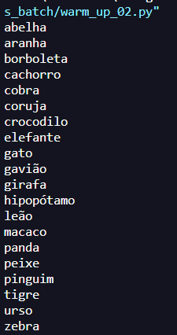
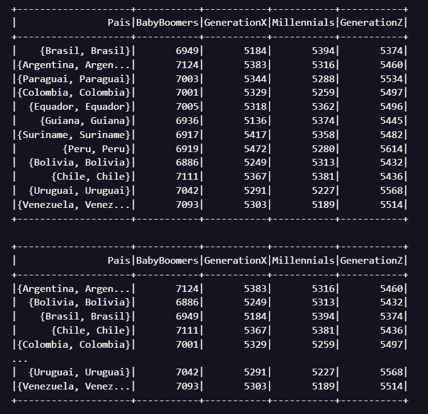

## TAREFA 1: EXERCICIO TMDB

Etapa 1 -  Criando sua conta no TMDB

Será preciso criar uma conta no porta do TMDB para, após, solicitar as chaves de acesso para uso da API.

Os passos são:

- Acessar o portal pelo link https://www.themoviedb.org/
- Clique no botão Junte-se ao TMDB na barra de navegação no topo da página
- Preencha o formulário de inscrição com as informações solicitadas e clique em Registrar. Utilize seu e-mail pessoal neste passo.
-  Você irá receber um e-mail de confirmação. Siga o processo solicitado
- Faça login em sua nova conta no TMDB e vá para o seu perfil, clicando no ícone de usuário no canto superior direito da página
- Clique na guia  Visão geral, opção Editar Perfil
- Clique no menu API, à esquerda. A seguir, na opção Criar, escolhendo o tipo Developer
- Aceite os termos e preencha o formulário com as informações solicitadas sobre a aplicação.
----- Em Tipo de Uso, informe Pessoal
----- Em URL, você pode informar um endereço fictício.
----- No Resumo, informe que o objetivo é para estudos
.

Etapa 2 - Testando rapidamente as credenciais e a biblioteca

Uma vez que você tenha sua chave de API, você pode fazer solicitações à API usando a seguinte estrutura de URL:

https://api.themoviedb.org/3/{endpoint}?api_key={sua_chave_de_api}&{parâmetros_opcionais}

Onde {endpoint} é o recurso que você deseja acessar (por exemplo, movie/{movie_id} para obter detalhes de um filme específico) e {parâmetros_opcionais} são quaisquer parâmetros adicionais que você deseje incluir na solicitação (por exemplo, language=pt-BR para obter informações em português).

Abaixo exemplo de código Python

        import requests
        import pandas as pd

        from IPython.display import display

        api_key = "SUA CHAVE"

        url = f"https://api.themoviedb.org/3/movie/top_rated?api_key={api_key}&language=pt-BR"

        response = requests.get(url)
        data = response.json()

        filmes = []

        for movie in data['results']:
        df = {'Titulo': movie['title'],
        'Data de lançamento': movie['release_date'],
        'Visão geral': movie['overview'],
        'Votos': movie['vote_count'],
        'Média de votos:': movie['vote_average']}

        filmes.append(df)

        df = pd.DataFrame(filmes)
        display(df)

___

## Tarefa 3: Exercícios - Geração de massa de dados

Desenvolva o código localmente utilizando o editor de sua preferência. Ao concluir, adicione os artefatos de código ao seu repositório no Github para avaliação do monitor(a) da Sprint.

Lembre-se que as tarefas são pré-requisitos para a execução do laboratório de Apache Spark na sequência. Não esperamos que você registre resposta neste espaço. Contudo, deves adicionar o código-fonte produzido ao seu repositório no Github para posterior avaliação pelo monitor(a).

Perguntas dessa tarefa
[Warm up]  Em Python, declare e inicialize uma lista contendo 250 inteiros obtidos de forma aleatória. Após, aplicar o método reverse sobre o conteúdo da lista e imprimir o resultado.

[Warm up] Em Python, declare e inicialize uma lista contendo o nome de 20 animais. Ordene-os em ordem crescente e itere sobre os itens, imprimindo um a um (você pode utilizar list comprehension aqui).  Na sequência, armazene o conteúdo da lista em um arquivo de texto, um item em cada linha, no formato CSV.

[Laboratório] Elaborar um código Python para gerar um dataset de nomes de pessoas. Siga os passos a seguir para realizar a atividade:

Passo 1:  Instalar biblioteca names para geração de nomes aleatórios. O comando de instalação é pip install names

Passo 2 Importar as bibliotecas random, time, os e names em seu código

Passo 3: Definir os parâmetros para geração do dataset, ou seja, a quantidades de nomes aleatórios e a quantidade de nomes que devem ser únicos.

Define a semente de aleatoriedade

            random.seed(40)

            qtd_nomes_unicos = 3000

            qtd_nomes_aleatorios = 10000000

Nota: Quando trabalhamos com números randômicos em computação, na realidade, estamos falando de valores pseudoaleatórios, uma vez que o computador não consegue gerar números verdadeiramente aleatórios. No caso do Python, a função random.seed inicializa o algoritmo responsável pela geração de valores randômicos. É um processo determinístico,  pois os valores gerados serão sempre os mesmos se utilizado a mesma configuração de inicialização. A este número inicial chamamos de semente de aleatoriedade.

Passo 4: Gerar os nomes aleatórios.

            aux=[]

            for i in range(0, qtd_nomes_unicos):

                aux.append(names.get_full_name())

            print("Gerando {} nomes aleatórios".format(qtd_nomes_aleatorios))

            dados=[]

            for i in range(0,qtd_nomes_aleatorios):

                dados.append(random.choice(aux))

Passo 5: Gerar um arquivo de texto contendo todos os nomes, um a cada linha. O nome do arquivo deve ser nomes_aleatorios.txt

Passo 6: Abrir o arquivo e verificar seu conteúdo (editor de texto)

___

## Tarefa 4: Exercícios - Apache Spark

Neste laboratório usaremos um arquivo CSV para criar um Dataframe e testar comandos SQL. Iremos utilizar o arquivo nomes_aleatorios.txt gerado na tarefa anterior. Esse arquivo tem aproximadamente 10 milhões de nomes distintos e apresenta os nomes mais populares registrados em cada ano.

Nota: Caso você encontre um erro ao executar seu código PySpark localmente, como o demonstrado na imagem abaixo,  é possível que você precise configurar o caminho para o interpretador do Python. Para isso, vá até o diretório conf da sua instalação do PySpark, e crie um arquivo chamado spark-env.cmd.  Nele, adicionar a linha abaixo, substituíndo <caminho python>  pelo respectivo caminho completo até o executável do interpretador (python.exe).

            set PYSPARK_PYTHON=<caminho python>

Referência complementar para o caso: java - encountered a ERROR that Can't run program on pyspark - Stack Overflow

Perguntas dessa tarefa

Inicialmente iremos preparar o ambiente, definindo o diretório onde nosso código será desenvolvido. Para este diretório iremos copiar o arquivo nomes_aleatorios.txt.
Após, em nosso script Python, devemos importar as bibliotecas necessárias:

                from pyspark.sql import SparkSession

                from pyspark import SparkContext, SQLContext

Aplicando as bibliotecas do Spark, podemos definir a Spark Session e sobre ela definir o Context para habilitar o módulo SQL

                spark = SparkSession \

                                .builder \

                                .master("local[*]")\

                                .appName("Exercicio Intro") \

                                .getOrCreate()

Nesta etapa, adicione código para ler o arquivo nomes_aleatorios.txt através do comando spark.read.csv. Carregue-o para dentro de um dataframe chamado df_nomes e, por fim, liste algumas linhas através do método show. Exemplo: df_nomes.show(5)
No Python, é possível acessar uma coluna de um objeto dataframe pelo atributo (por exemplo df_nomes.nome) ou por índice (df_nomes['nome']). Enquanto a primeira forma é conveniente para a exploração de dados interativos, você deve usar o formato de índice, pois caso algum nome de coluna não esteja de acordo seu código irá falhar.

Como não informamos no momento da leitura do arquivo, o Spark não identificou o Schema por padrão e definiu todas as colunas como string. Para ver o Schema, use o método df_nomes.printSchema().
Nesta etapa, será necessário adicionar código para renomear a coluna para Nomes, imprimir o esquema e mostrar 10 linhas do dataframe.
Ao dataframe (df_nomes), adicione nova coluna chamada Escolaridade e atribua para cada linha um dos três valores de forma aleatória: Fundamental, Medio ou Superior.

Para esta etapa, evite usar funções de iteração, como por exemplo: for, while, entre outras. Dê preferência aos métodos oferecidos para próprio Spark.
Ao dataframe (df_nomes), adicione nova coluna chamada Pais e atribua para cada linha o nome de um dos 13 países da América do Sul, de forma aleatória.
Para esta etapa, evite usar funções de iteração, como por exemplo: for, while, entre outras. Dê preferência aos métodos oferecidos para próprio Spark.
Ao dataframe (df_nomes), adicione nova coluna chamada AnoNascimento e atribua para cada linha um valor de ano entre 1945 e 2010, de forma aleatória. 
Para esta etapa, evite usar funções de iteração, como por exemplo: for, while, entre outras. Dê preferência aos métodos oferecidos para próprio Spark.
Usando o método select do dataframe (df_nomes), selecione as pessoas que nasceram neste século. Armazene o resultado em outro dataframe chamado df_select e mostre 10 nomes deste.

Usando Spark SQL repita o processo da Pergunta 6. Lembre-se que, para trabalharmos com SparkSQL, precisamos registrar uma tabela temporária e depois executar o comando SQL. Abaixo um exemplo de como executar comandos SQL com SparkSQL:

                df_nomes.createOrReplaceTempView ("pessoas")

                spark.sql("select * from pessoas").show()

Usando o método select do Dataframe df_nomes, Conte o número de pessoas que são da geração Millennials (nascidos entre 1980 e 1994) no Dataset
Repita o processo da Pergunta 8 utilizando Spark SQL
Usando Spark SQL, obtenha a quantidade de pessoas de cada país para uma das gerações abaixo. Armazene o resultado em um novo dataframe e depois mostre todas as linhas em ordem crescente de Pais, Geração e Quantidade

- Baby Boomers – nascidos entre 1944 e 1964;

- Geração X – nascidos entre 1965 e 1979;4

- Millennials (Geração Y) – nascidos entre 1980 e 1994;

- Geração Z – nascidos entre 1995 e 2015.

___

* [Desafio Parte 2](/Desafio/parte_02)

Compreende a captura dos tweets em tempo real com Python e/ou a captura de dados existentes na API TMBD. Os dados coletados devem ser persistidos em Amazon S3 RAW Zone, mantendo o formato da origem (JSON), agrupando-os em arquivos com, no máximo, 100 tweets cada quando possível